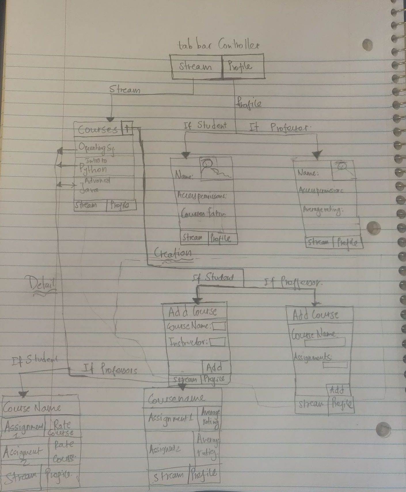
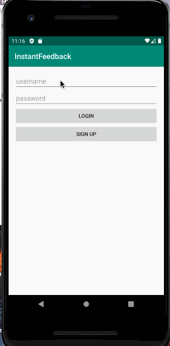
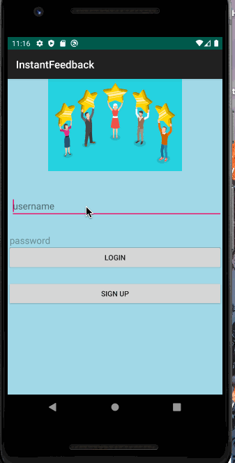

CS:Wait Codepath Project - README Template
===

# Instant Feedback for Sahet Branch

## Table of Contents
1. [Overview](#Overview)
1. [Product Specifications](#Product-Spec)
1. [Wireframes](#Wireframes)
2. [Schema](#Schema)
2. [VideoWalkthroughs](#VideoWalkthroughs)

## Overview
### Description

An application for professors and mentors to see instant feedback given by students regarding their assignments.

### App Evaluation
[Evaluation of your app across the following attributes]
- **Category:** Academics 
- **Mobile:** Mobile Phones are essential for instant feedback as it is protable, and user friendly. App that allows students to log in to accounts and give feedback to particular classes. Professors get the aggregate results and use the data to alter the course of the class.
- **Story:** In many colleges, students are required to give feedback about a course at the end of the semester. This feedback does not help to know about students view on the course during the semester which could allow to make changes and adjustments accordingly. Thus, we thought about making a rating based review app for all assignments in the course so that the instructor can keep track of student responses, and make improvements accordingly throughout the semster.  

- **Market:** Our primary customers will be schools from K-12, and universities that want to know about students' view on the course during the semester. This could also be a valuable asset for the education ministry to make certain changes after analyzing the data over the course of a particular time period. 

- **Habit:** Teachers/Professors will be using this after every assignment to get feedback, and make adjustment if needed to the next assignment. Students will be required to provide feedback at the end of every assignment.

- **Scope:** Version 1 will allow professors, and teachers to add a course and assignments, and students to keep track fo that specific course. Version 2 will allow students to rate the assignments, and professors to view the feedback. Version 3 will graph, and make visualization based on the data. Version 4 will have machine learning/sentiment analysis, to allow textual feedback, and its analysis. 

## Product Spec

### 1. User Stories (Required and Optional)

**Required Must-have Stories**

* [x] Students and Professors can create an account.
* [x] Students and Professors login to the app. 
* [x] Professors can add a course, and assignments within it. 
* [x] Students can provide a rating in five stars for all the added assignment.  
* [x] Professors can see the feedback as the average number of stars for each assignment.
*     Students can register for the available courses. 
*     Professor and students can view their courses.


**Optional Nice-to-have Stories**

* Make real time graph, and charts based on student feedback.
* Implement sentiment analysis/machine learning/NLP so that student  can provide feedback in paragraph. 

### 2. Screen Archetypes

* Login  - User logs into their account
   * Students and Professors login to the app. 
   * 
* Register - User signs up for a new account 
   * Students and Professors can create an account
   * 
* Creation - User can create a new resource
   * Professors can add a course, and assignments within it. 
   * Students can register for the available courses. 
   
* Stream - User can scroll through important resources in a list
   * Professor and students can view their courses.
   
* Profile - User can view their identity and stats
   
* Detail- User can view the detail of particular resource. 
    *  Professors can see the feedback as the average number of stars for each assignment of a course.
     * Students can provide a rating in five stars for all the added assignment.

### 3. Navigation

**Tab Navigation** (Tab to Screen)

* Creation 
* Stream

**Flow Navigation** (Screen to Screen)

*  Login
    * Stream 
    * Register
* Register
    * Stream 
* Stream
    * Creation 
    * Detail
* Creation
    * Stream
* Detail
    * Stream 


## Wireframes
[Add picture of your hand sketched wireframes in this section]


### [BONUS] Digital Wireframes & Mockups

### [BONUS] Interactive Prototype

## Schema 

### Models

### Course 

   | Property      | Type     | Description |
   | ------------- | -------- | ------------|
   | CourseName      | String   | unique id for the course (default field) |
   | Author       | Pointer to Professor| sets professor for the course |
   | Students       | List of Pointers to Students     | Tracks students who are taking the course  |
   | CourseDescription       | String   | Description of the course |
   | Assignments | List of Pointers to assignments   | Objectives assigned to students in a class |
   | AssignmentDescription    | String   | Description of the assignment |
   
#### User 

   | Property      | Type     | Description |
   | ------------- | -------- | ------------|
   | UserName      | String   | unique id for the course (default field) |
   | UserEmail       | String  | user email used to sign-in |
   | Password       | String   | User password |
   | UserType | String   | Professor or Student Defined |
   | Courses | List of pointers    | all the courses affiliated with the user (List of pointers to Courses) |


#### Assignment 

   | Property      | Type     | Description |
   | ------------- | -------- | ------------|
   | AssignmentName      | String   | Name of the assignment |
   | Course     | Pointer to Course |  course with the assignments  
   | Rating       | Number     | Rating of the assignment  |
   | AssignmentDescription       | String   | Description of the Assignment
   
   
### Networking
   - Stream Screen
      - (Read/GET) Query all the courses for the User  
         ```swift
         let query = PFQuery(className:"Course")
         query.whereKey("author", equalTo: currentUser)
         query.findObjectsInBackground { (courses: [PFObject]?, error: Error?) in
            if let error = error { 
               print(error.localizedDescription)
            } else if let courses = courses {
               print("Successfully retrieved \(courses.count) courses.")
           // TODO: Do something with posts...
            }
         }```
     - (Add/Edit) course from the existing course for the User=Student. 
          ```swift 
             let query = PFQuery(className:"User")
              query.whereKey("author", equalTo: currentUser)
              query.findObjectsInBackground { (courses: [PFObject]?, error: Error?) in
              if let error = error { 
                 print(error.localizedDescription)
                } else if let courses = courses {
                 print("Successfully retrieved \(courses.count) courses.")
               // TODO: Do something with posts...
                 }
               }
               courses.add(Course course) 
               currentUser.setKeyCourse(courses)
               currentUser.saveInBackground(new SaveCallback() {
            @Override
            public void done(ParseException e) {
                if(e!=null)
                {
                    Log.e(TAG,"Error while saving",e);
                    Toast.makeText(getContext(), "Error while saving", Toast.LENGTH_SHORT).show();
                }
                Log.i(TAG,"post was succesful");
                Description.setText("");
            }  });```
        

  - Creation Screen 
      - (Create/POST) Create a new course 
         ```swift 
             Course course=new  Course();
             course.setKeyDescription(description);
             course.setKeyUser(currentUser);
             course.saveInBackground(new SaveCallback() {
                @Override
                public void done(ParseException e) {
                    if(e!=null)
                    {
                        Log.e(TAG,"Error while saving",e);
                        Toast.makeText(getContext(), "Error while saving", Toast.LENGTH_SHORT).show();
                    }
                    Log.i(TAG,"post was succesful");
                    Description.setText("");
                  }  
               });```
     
    - Register
      -(Create/POST) Create a new user 
       ```swift 
           User user=new User();
           user.setUserName();
           user.setPassword();
           user.saveInBackground(new SaveCallback() {
              @Override
              public void done(ParseException e) {
                  if(e!=null)
                  {
                      Log.e(TAG,"Error while saving",e);
                      Toast.makeText(getContext(), "Error while saving", Toast.LENGTH_SHORT).show();
                  }
                  Log.i(TAG,"post was succesful");
                  Description.setText("");
              }  
          });```
      
      
## VideoWalkthroughs

## Sprint 1 
Here's a walkthrough of implemented user stories in our first sprint. 



## Sprint 2
Here's a walkthrough of implemented user stories in our first sprint. 




